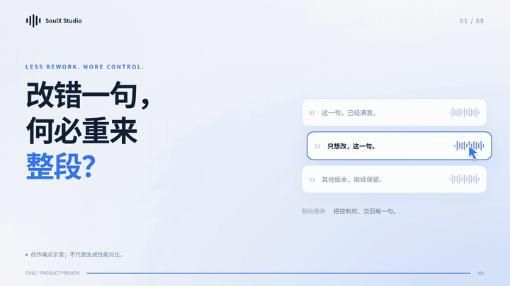
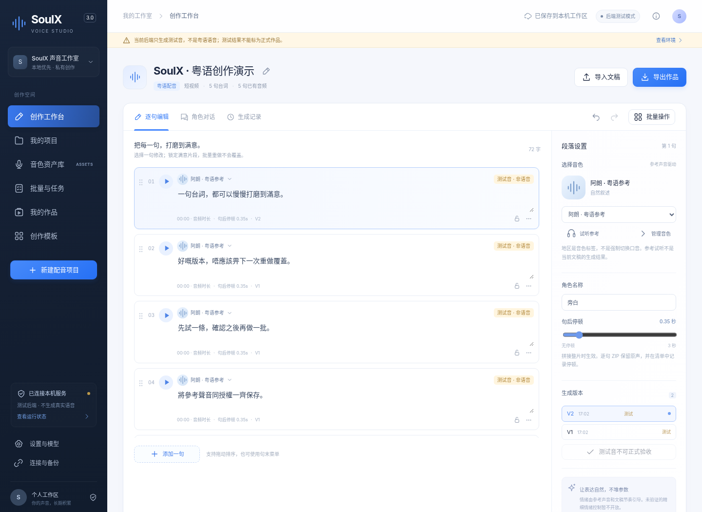

# SoulX Studio

### 粤语声音生产工作台 · Cantonese Voice Workbench

**逐句修改 · 批量制作 · 长期声音资产**  
**Edit a sentence. Keep the good takes. Build your voice library.**



> **Developer preview — 3.0.1 / public-preview.1.**  
> 这是 OING 基于 [Soul AI Lab / SoulX-Podcast](https://github.com/Soul-AILab/SoulX-Podcast) 开发的独立工作台，不是原模型官方客户端，也不是一个新训练的模型。Mac / Windows 的安装入口已交叉编译，但目标电脑首次安装、签名、公证和真实粤语质量仍需验收。动画中的版本和队列使用明确标注的测试音，不是成功粤语合成的证明。

## 为什么做这个项目？

配音生产不应该停在“输入一大段文字，等一个音频”。实际创作需要改一句、保留上一版、固定常用声音、批量处理同类文稿，并把已经认可的素材保存下来。

SoulX Studio 把这些工作放到同一个本地优先的界面中：**文稿 → 逐句生成 → 试听 → 局部重做 → 验收 → 导出**。工作台与推理引擎分离；没有模型时仍可编辑，缺少推理条件时明确报错，不回退成假语音。

## 已实现的工作流

| 模块 | 当前行为 |
|---|---|
| 逐句工作台 | 文稿拆分、角色、音色、句后停顿、复制、排序、锁定、撤销/重做 |
| 版本保留 | 重做创建新任务；保留 V1/V2；文稿或音色变化后标记旧音频不匹配 |
| 批量与队列 | TXT / Markdown / CSV 导入、统一设置、跳过锁定段落、任务暂停/恢复/取消请求 |
| 声音资产 | 参考音频上传与实际解码、转写、授权来源、标签、收藏、回收站 |
| 项目与保存 | 项目、模板、归档；浏览器存储或可选本机 SQLite；多窗口修订冲突检查 |
| 试听与输出 | 真实波形、逐句试听、版本选择；WAV/ZIP，环境具备 FFmpeg 时支持 MP3 |
| 桌面入口 | Go 原生运行中心，用户目录独立 Python 环境，本机服务管理与诊断 |



*实际编译界面截图。演示文字为专门撰写的样例；队列与版本结果为测试音，不是客户作品或新的粤语音质样本。*

## 开始使用

### 安装预览包

发行附件包括 Mac Apple Silicon、Windows x64，以及仅开放工作台的 Intel Mac 包。完整说明见 [安装指南](docs/CROSS_PLATFORM_INSTALL.md)。

**Mac：**解压后把 `SoulX Studio.app` 放入“应用程序”，打开本机安装中心。  
**Windows x64：**解压并运行 `SoulX-Studio-Setup.exe`。

在中心选择“先安装工作台”，或安装本机语音组件。安装器无需用户预装 Python，但**首次安装需要网络**，因为运行时、依赖、主模型和辅助资源并未全部内置。已有模型可以填写路径并校验；约 5.45 GB 的主模型不是全部资源占用。

**未签名/未公证：**系统可能阻止运行。不要关闭系统安全机制绕过提示；这属于本预览版尚未完成的发布验收。

> 分发状态和验收范围见 [PUBLICATION.md](PUBLICATION.md) 与 [公开版本核查](docs/PUBLIC_REVIEW.md)。源码包不含已安装的语音环境或模型权重。

### 从源码看前端

已有 Python 3 时：

```bash
python preview.py
```

默认打开本机 `http://127.0.0.1:18782/`。这只是前端预览，不会自动生成语音。

### 启动本地 API

```bash
python -m venv .venv
# macOS / Linux
source .venv/bin/activate
# Windows PowerShell: .venv\Scripts\Activate.ps1
python -m pip install -r requirements.desktop.txt
python run_studio.py
```

服务在 `http://127.0.0.1:18781/app/`。以上安装的是工作台依赖，**不是完整语音依赖**。语音路径还需要匹配的 Torch / torchaudio、`requirements.speech-desktop.txt`、主模型和 tokenizer 资源。普通用户优先使用安装中心，不要把源码启动成功当成推理通过。

进行纯流程测试时，可以显式使用单独数据目录：

```bash
python run_studio.py --dry-run --data-dir workbench_test_data
```

**dry-run 只输出测试音。**界面会标明，不能验收为正式语音作品。

## 明确边界

- 地区是参考音色标签，不是保证广州、香港或茂名口音的开关。
- 参考音色驱动不是为每个用户重新训练专属模型。只能使用自己的声音或获得明确授权的声音。
- 双人界面是按角色逐句制作，不代表多人同时发声、独立多轨推理或长上下文连续性已解决。
- 本版没有任意情绪精确滑块、自动粤语文案改写、词级字幕对齐、完整多轨混音器。
- 整片 WAV 拼接要求编码相容；失败时应保留逐句原声导出，而不是宣称完成。
- 不要把本机服务直接作为公网多租户服务；这里没有为公网部署设计完整账户、计费或隔离体系。

## 保存、更新与迁移

应用代码、运行环境、模型、缓存和 `workspace/` 数据分开保存。新的安装尝试使用新的环境目录，失败不会原位覆盖旧环境。旧工程不会被自动迁移或删除。

浏览器数据与可选 SQLite 文稿工作区不是自动双向同步。在设置里选择本机工作区后，要确认保存状态。JSON 备份不一定包含仅存在服务端的所有音频文件，请同时导出重要结果和备份声音资产。

安全退出会暂停新任务领取并保留队列；再次使用时可在任务中心恢复。

## 测试与构建

```bash
python -m pip install -r requirements.dev.txt
python -m pytest tests -q
python scripts/build_desktop_installers.py --payload-only
cd desktop-installer
go test -v ./...
```

本轮公开整理重新执行了后端测试和安装器测试；结果与范围记录在 [PUBLIC_REVIEW.md](docs/PUBLIC_REVIEW.md)。不存在未经运行却显示绿色的 CI 徽章。提供的 GitHub Actions 工作流需在真实仓库运行后才会有平台测试结果。

构建前端需要 TypeScript；成品前端无需外部 CDN：

```bash
cd frontend
npm install
npm run build
```

构建原生在线安装预览包需要 Go 1.23+ / Python 3.11+：

```bash
python scripts/build_desktop_installers.py
```

## 宣传片与可编辑工程

本项目配有 **48 秒、1080×1920 竖版和 1920×1080 横版**宣传片。视觉是实际前端截图的动效演示；音乐与效果音为新编写的程序化配乐，**没有旁白，也没有使用 SoulX 生成语音**。

制作继承了 OING 的 `brand-reference-remake 1.0.0-candidate` 方法：痛点开场、产品揭示、逐层放大操作证据、品牌落版，并做横竖构图和确定性渲染检查。参考广告素材、原音轨、私人项目文件和系统字体文件不随此项目公开。

## 项目关系与许可

OING 贡献了工作台、前端、安装与流程适配；底层推理代码保留上游来源与 Apache-2.0 许可。模型权重及第三方软件遵循各自条款。单个归档粤语参考音频以独立 CC BY 4.0 说明保留，其包含不意味着可以冒充该说话人。

详见 [LICENSE](LICENSE)、[NOTICE](NOTICE)、[THIRD_PARTY_NOTICES.md](THIRD_PARTY_NOTICES.md)、[参考音频来源](example/audios/ATTRIBUTION.md)。欢迎通过可复现问题、真实目标系统测试和小范围补丁参与；请勿提交私人声音、数据库或密钥。

---

### English overview

SoulX Studio is an independent, local-first Cantonese voice-production workbench built around Soul AI Lab's SoulX-Podcast inference code. It focuses on sentence-level editing, retained takes, batch queues and reusable, authorized reference voices. It is **not the official model client** and does not claim a new model.

The public developer preview includes source code, compiled web UI, and native online bootstrap installers for Apple Silicon macOS and Windows x64. Intel Mac is workbench-only. The target-platform installation, publisher signing, Apple notarization and genuine Cantonese synthesis quality remain to be verified. The promotional film demonstrates the actual UI using explicitly labeled test-tone jobs; it is not speech-quality evidence.
